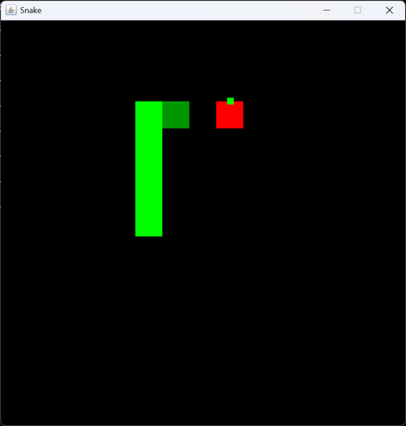

# Snake
Play the classic game of snake made in Java Swing!


## Instructions
Up arrow - move up

Down arrow - move down

Right arrow - move to the right

Left arrow - move to the left

## Goal
Collect all the apples
## Building and Runnig
### Compile
```bash
cd src
javac *.java
```
### Run
```
java App.java
```
### Note for Linux users
A display server is required to run this application
